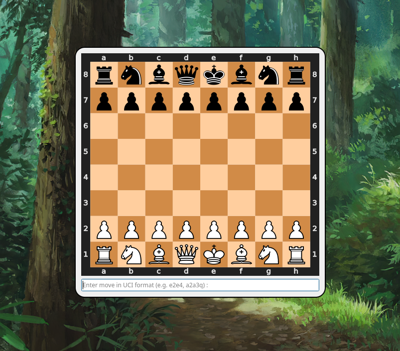

# Chestnut 

Chess engine ("chess") with a brain of a nut ("nut").

 

Monte Carlo Tree Search (MCTS) Reinforcement Chess Engine with both Expert and Self-play Training. 

## Prerequisites

Ensure that your system meets the following requirements:
* Python `>= 3.11.12`
* `uv` (optional but recommended)

```terminal
pip install uv
```

* Required data files:
    * `data/move_map.pickle` - move mapping used by the chess engine.
    * `model/CHESSMODEL_CHECKPOINT_100_EPOCHS.pth.tar` - trained chess model checkpoint.

These files must exist in the specified directories for the code to run correctly.

## Build Instructions 

Install the expert or self-play trained model [via GoFile](https://gofile.io/d/3vQ3Cx) into `chestnut/model`

* Using `uv` (recommended)

```terminal
cd chestnut
uv sync # remember to activate your existing venv
cd src
uv run main.py
```

* Using `pip`

```terminal
cd chestnut
pip install -r requirements.txt
cd src
python main.py
```

## How it works 

### Dataset Preprocessing

We use the lichess-elite dataset, which consists of filtered standard chess games played on Lichess. The dataset includes games where one player is rated 2400+ and the opponent is rated 2200+, with bullet games excluded to ensure higher-quality strategic play. All games are provided in Portable Game Notation (PGN) format.

Each PGN file contains multiple chess games, containing every game records (such as player ratings, time, and game result) along with a sequential list of mainline moves from the initial position to the end of the game. Using the python-chess library, each game is parsed and converted into a chess.Game object, which allows traversal of board states and legal moves.

### Encoding of Input Features 

For every position in a game, we encode the board state into a tensor representation (move tensor) used as the training input, while the target output is the next move played in the game, represented in Universal Chess Interface (UCI) notation and treated as a classification label. The first 12 channels are 2D matrices representing the chessboard grid and correspond to the locations of the unique chess pieces (pawn, knight, bishop, rook, queen, and king) for both colors, encoded using one-hot representations. The final channel encodes all legal destination squares for the current board state. Each piece plane is one-hot encoded, where a value of 1 indicates the presence of a specific piece on a given square, and 0 otherwise. The mapping from board squares to tensor indices is derived from the each board each piece with its unique square index (e2, a4, f7, etc).

### Target Representation

The target label for each training sample is the next move played in the actual game, represented in UCI format (e2e4, b2b4, etc). 
The learning task is treated as a multi-class classification problem, where the model predicts the next move given the current board state.

Instead of encoding all theoretically possible chess moves, we construct a move mapping only from the moves that appear in the target data. 
This significantly improves computational efficiency and reduces sparsity in the output layer. However, it restricts the model to learn moves that only exist in the training dataset. As a result, the model cannot explore or suggest any new legal moves that were never observed during training, even if those moves are valid in a given position. This constraint may limit generalization and creative play, especially in rare or unconventional positions.

### Model Architecture

The model is split into two main parts, feature extraction and classification. It first analyzes the position of the pieces and learn board patterns. In each block of the feature extractor, a 2D convolution is applied with a ReLU activation function, accepting the move tensor as input. This stage transforms the board into a rich internal representation that captures the current state of the game.

Furthermore, classification predicts the next move by outputting probabilities for each possible legal move, using dropout, which randomly turns off certain neurons in a layer to force the network to not rely on a single neuron, to improve generalization. This combination of feature extraction and classification enables the model to understand the board and make informed move predictions in a single forward pass.

### Training 

The chess dataset is loaded for training using CrossEntropyLoss as the loss function and the Adam optimizer to update the model’s weights. The model is trained for 100 epochs, as further training beyond this epochs has a tendency to cincrease the loss, indicating overfitting. During training, gradient clipping is applied, which limits the size of the gradients to prevent them from gradient explosion which can destabilize learning. To make sure that our training progress is not lost, the model is saved as a checkpoint at every 10 epochs for safekeeping.

### Prediction


During prediction, the model takes a board state provided by the user and encodes it into a move tensor as input. The model then outputs logits, which are converted into a probability distribution using the softmax function. These probabilities are sorted in descending order to find the best move suggested by the model. The model then checks each move, from highest to lowest probability, if it's a legal action in the current board state. The first legal move found is returned as the model’s predicted move.


### Widget 

We use the PyQt5 library to create the chess user interface. At first, the player can either choose to play white or black. The chess engine and move mapping are then initialized to allow the model to predict the next move. The interface displays the chessboard as an SVG graphic using the python-chess library and accepts user input in UCI notation, which is located below the board. If an illegal move is entered, the interface warns the user and resets the input. When a legal move is played, the board updates and so the model predicts the next best move. Moreover, the engine's best predicted move is then applied to the board and displayed to the user. After each move, the interface checks the board for game-ending conditions and displays the appropriate result, like checkmate, stalemate, or draw by repetitions.


# Notes

## Monte Carlo Tree Search with Upper Confidence Bound

MCTS is used on games with extremely high branching factor that min-max algorihtms cannot handle.

Reference : [link](https://ai-boson.github.io/mcts/)

### Selection

Keep selecting the best nodes (highest UCT) until the leaf node.

wi/ni + c*sqrt(t)/ni

wi = number of wins after the i-th move
ni = number of simulations after the i-th move
c = exploration parameter (theoretically equal to √2)
t = total number of simulations for the parent node

### Expansion 

When UCT is unable to find the sucessor node, it expands the tree by appending all possible state to the leaf node.

### Simulation

After expansion, it simulates the entire game from the selected node until the end of the game. If nodes are picked randomly, it is called light play out. Else, heavy play out uses heuristics and evaluation functions.

### Backpropagation

When reaching the end of a game, it traverses upwards to the root and increment visit scores for all nodes. Then, it updates win score for each node if the position of that player wins the playout. (past moves in traversed tree)
